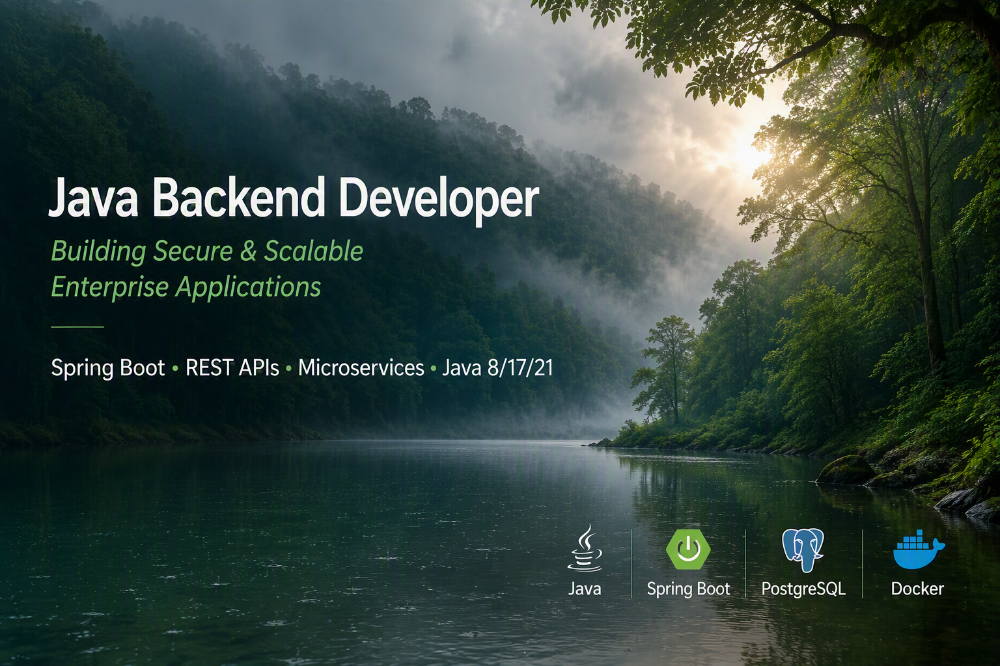

<!-- Header with Gifs -->

<!--      --> 
  

<h1 align="center">Hi there, I'm Nikhil! 👋</h1>

<h3 align="center">☕ Java Developer | 2.3+ Years of Hands-On Java Development | Spring Boot Specialist</h3>

  
  

---

### 💫 About Me

I'm a **Java Backend Developer with 2.3+ years of hands-on development experience**, backed by an additional **1 year of Java technical support experience** — giving me a solid foundation in both *building* Java applications and *understanding how they behave, break, and get fixed* in real production environments.

I specialize in designing and building REST APIs and full-stack applications using **Spring Boot**, with working knowledge across relational databases including **MySQL, MariaDB, PostgreSQL, and Oracle**. I'm equally comfortable working with an ORM or dropping down to raw JDBC when I need full control over what's actually happening at the database layer.

---

### 🌱 What I Bring to the Table

- ⚙️ **2.3+ years of Java development experience** building backend systems and REST APIs
- 🛠️ **1 year of Java technical support experience** — real-world debugging, issue triage, and production troubleshooting
- 🍃 Strong hands-on expertise in **Spring**, **Spring Boot**, **Spring Data JPA**, and **Spring AI**
- 🗄️ Multi-database experience: **MySQL, MariaDB, PostgreSQL, Oracle**
- 🔌 Comfortable working both with ORM abstractions *and* raw JDBC when precision matters
- 🤖 Actively exploring **AI-integrated backend systems** using Spring AI with local LLMs
- 🧩 Solid grasp of REST API design, Maven, Git, and Postman-driven development workflows

---

### 🛠️ Featured Projects

#### 🧠 [TriMind AI](https://github.com/Nik308m/TriMind-AI)
A multi-persona AI assistant platform running a locally-hosted **Mistral 7B** model via **Ollama**, orchestrated through **Spring AI** on Java 21 + Spring Boot.
- Three specialized AI personas (general assistant, email assistant, code assistant) with tuned system prompts
- Conversational memory per session using Spring AI's chat memory
- Fully local LLM inference — no external API costs or third-party data exposure

#### 💰 [Personal Finance Tracker](https://github.com/Nik308m/personal-finance-tracker)
A full-stack expense management app built on Java 17 + Spring Boot with a **hand-written JDBC data access layer**.
- Custom spending categories with uploaded image icons stored as binary data
- Dynamic multi-criteria filtering engine (date range, amount range, category, type)
- Visual analytics via pie chart and trend graphs, plus one-click Excel export

#### 📺 [NikTube]( https://github.com/Nik308m/multimedia-streaming-app)
A YouTube-inspired media platform built with Java 17 + Spring Boot for uploading, streaming, and downloading video and music files.
- Media stored and served directly from a relational database (PostgreSQL)
- Multi-database support across PostgreSQL, MySQL, and MariaDB
- Handles large file uploads (up to 3GB) for real video/audio content

---

### 🎓 Education
- **Master of Science in Information Technology ** — Mumbai University(2022)

---

### 📬 Let's Connect

I'm actively looking for opportunities as a Java Backend Developer. Open to collaboration, technical discussions, and new challenges — feel free to reach out!!!

- 📧 Email: *nik.308m@gmail.com*
- 💼 LinkedIn: *https://www.linkedin.com/in/nik-308m/*
- 🔗 GitHub: *https://github.com/Nik308m*

## 🌐 Socials:

# 💻 Tech Stack:
             

# 📊 GitHub Stats:
 
 

## 🏆 GitHub Trophies

### 🔝 Top Contributed Repo

---

<!-- Proudly created with GPRM ( https://gprm.itsvg.in ) -->

